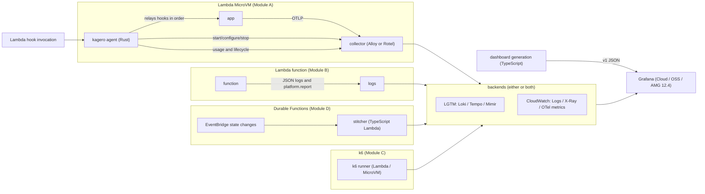

# kagero — Overall design

> English translation of [architecture.md](architecture.md) (Japanese is canonical). Last synced: 2026-09-27.

- Status: implementation is ahead of this document (deviation recorded in [ADR-012](../decisions.en.md)). The design will be finalized based on PoC results.
- Last updated: 2026-09-26
- Related documents: [MicroVMs design](microvms.en.md) / [Functions, Durable, and k6 design](functions-durable-k6.en.md) / [ADR](../decisions.en.md) / [Roadmap](../roadmap.en.md) / [PoC](../poc/README.en.md) / [Research (Japanese)](../research/2026-09-landscape.md)

## 1. Goals and non-goals

### Goals

- Make the Lambda family (functions, Managed Instances, Durable Functions, MicroVMs) observable in Grafana.
- Provide the same view whether telemetry is sent to LGTM or to CloudWatch.
- Ship, as OSS, the "computed metrics" that only commercial products offer — estimated cost and cold-start cost, for example.

### Non-goals

- We do not aim to run Grafana itself on Lambda; alert evaluation requires a long-running process.
- We will not build a data source plugin that invokes Lambda; there is no sign of demand.
- AI-driven incident response (AI SRE) is out of scope; the field is already crowded.
- Until v1.0, we will not build a custom Lambda extension; first we consolidate what logs and PromQL can reach.

## 2. Overall architecture



## 3. Repository layout

Implementation is ahead of the docs ([ADR-012](../decisions.en.md)); this is the current layout.

```text
kagero/
├── crates/
│   └── kagero-agent/         # MicroVM の中で動くエージェント（唯一の Rust 部品）
├── packages/                 # pnpm workspace（TypeScript）
│   ├── semconv/              # 属性の定数と文書の生成器（Weaver 互換スキーマの YAML が正本）
│   ├── secrets/              # Secrets Manager の ARN 解決（durable-stitcher / k6-runner 共用）
│   ├── pricing/              # 単価表とコストの計算式
│   ├── dashboards/           # ダッシュボードとアラートの仕様、バックエンド別の adapter
│   ├── sim/                  # フックの simulator（E2E 用）
│   ├── durable-stitcher/     # モジュール D の Lambda
│   ├── k6-runner/            # モジュール C の Lambda
│   └── cdk/                  # CDK constructs
├── semconv/registry/         # 属性の定義（Weaver 互換スキーマの YAML）
├── collector/
│   ├── alloy/                # LGTM 向けの Alloy（river）テンプレート
│   ├── lgtm/                 # LGTM 向けの OTel collector テンプレート
│   ├── cloudwatch/           # CloudWatch 向けの収集器の設定
│   └── rotel/                # Rotel での代替設定
├── generated/                # 生成して commit するダッシュボードとアラート
│   ├── dashboards/{lgtm,cloudwatch}/
│   └── alerts/{lgtm,cloudwatch}/
├── examples/                 # Node.js・Python の MicroVM イメージ例
└── docs/
```

## 4. Languages and tools

Languages are split by where the code runs ([ADR-001](../decisions.en.md#adr-001-monorepo-and-language-split)).

| Location | Language | Reason |
|---|---|---|
| Inside the MicroVM (agent) | Rust | Keeps memory and snapshots small. Ships as a single binary that fits into any image. Can manipulate processes and privileges directly |
| Outside (control Lambdas, CDK, dashboard generation, simulator) | TypeScript (Node.js 24) | CDK and the Grafana Foundation SDK are available in TypeScript. Control Lambdas are invoked rarely, so cold-start differences do not matter |

Tools:
- Rust: use `cargo fmt`, `cargo clippy -D warnings`, and `cargo test`. Produce a static ARM64 binary (`aarch64-unknown-linux-musl`). cargo-zigbuild is the candidate for cross-building.
- Main Rust crates (already implemented): tokio, hyper, serde, reqwest (rustls), libc.
- TypeScript: use strict mode, ES modules, Biome, vitest, and pnpm. Control Lambdas are deployed with CDK `NodejsFunction`.
- Attribute definitions: the canonical source is a Weaver-compatible schema YAML; the generator in `packages/semconv` emits the Rust and TypeScript constants and the docs (a migration path to OpenTelemetry Weaver itself is kept).
- Version pinning: pin tool versions with mise. Dependency updates are delegated to Renovate.
- CI: GitHub Actions. Builds and tests run on ARM64 Linux runners (`ubuntu-24.04-arm`).

## 5. Two backends

We support both LGTM and CloudWatch from the start ([ADR-002](../decisions.en.md#adr-002-supporting-two-backends-from-day-one)). A dual-send configuration is also provided for migration periods.

| Signal | Sending to LGTM | Querying in LGTM | Sending to CloudWatch | Querying in CloudWatch |
|---|---|---|---|---|
| Metrics | OTLP (Mimir / Grafana Cloud, Basic auth or Bearer) | PromQL (Prometheus data source) | OTLP HTTP (SigV4) | PromQL (AMP data source, `sigv4Service=monitoring`) |
| Logs | OTLP (Loki native ingestion) | LogQL | OTLP HTTP (SigV4) | Logs Insights (CloudWatch data source) |
| Traces | OTLP (Tempo) | TraceQL | OTLP HTTP (SigV4; requires Transaction Search) | X-Ray / Application Signals data source |

Collector configuration swaps only the destination part (exporters and authentication); receivers and processing are shared.

Points where behavior may differ (verified in [PoC-05 (Japanese)](../poc/05-backend-parity.md)):
- Metric name translation: unit suffixes, `_total`, UTF-8 quoting, and resource-attribute-to-label conversion may be handled differently.
- Limits: CloudWatch PromQL is capped at 500 series per query and a 7-day range.
- Histogram types and delta/cumulative temporality may be handled differently.
- Cost: CloudWatch PromQL charges per sample scanned by API queries; Logs Insights charges per volume scanned.
- OTLP sends to CloudWatch Logs name the log group and log stream in the `x-aws-log-group` and `x-aws-log-stream` headers, and both must exist beforehand (per the AWS docs; not yet verified on real AWS).

## 6. Attributes and cardinality

- Attributes defined in the OTel semantic conventions are used as-is (`service.*`, `cloud.*`, `faas.*`, etc.).
- Attributes not in the conventions get a `kagero.` prefix. If they are adopted upstream, we migrate to the upstream names.
- Definitions live in a single Weaver YAML file; code and docs are generated from it.

Key attributes (draft):

| Attribute | Content | Signals |
|---|---|---|
| `service.instance.id` | MicroVM ID (`microvmId` received via `/run`) | logs, traces |
| `kagero.microvm.image.name` | Image name | all |
| `kagero.microvm.image.version` | Image version | all |
| `kagero.microvm.size` | Baseline size (e.g. `2gb`) | all |
| `kagero.lifecycle.event` | `run`, `suspend`, `resume`, `terminate`, etc. | logs, metrics |
| `kagero.tenant.id` | Tenant ID (only when the app declares it) | logs, traces |
| `kagero.session.id` | Session ID (only when the app declares it) | logs, traces |

Cardinality rules ([ADR-008](../decisions.en.md#adr-008-identity-and-cardinality)):
- MicroVM, tenant, session, and request IDs are never put in metric labels; they go on logs and traces only.
- Metric labels are limited to low-cardinality dimensions: image name, version, size, region, etc.
- Per-MicroVM and per-tenant aggregation is computed from the "usage summary log" emitted on every suspend and terminate.

## 7. Dashboard and alert specification

A single specification generates outputs for both backends ([ADR-010](../decisions.en.md#adr-010-dashboard-and-alert-spec)).

- Spec: written with the Grafana Foundation SDK (TypeScript). Panels reference "semantically named metrics" and "named recipes" for logs and traces (up to 15). Layout, units, and thresholds are shared.
- Adapters: one per backend. Each contains data source references, conversion from OTel names to PromQL selectors (with an exception table), recipe implementations, and a support matrix.
- Unsupported panels: a panel that cannot be produced on one backend becomes a text panel stating "not supported on this backend". Nothing is silently dropped.
- Output: v1 JSON, because Amazon Managed Grafana 12.4 does not support schema v2. Grafana 13 migrates v1 automatically.
- Location: generated artifacts are committed under `generated/`. CI regenerates them and verifies there is no diff.
- Validation: snapshot tests plus PromQL/LogQL syntax checks; the syntax-check tooling is decided in PoC-05 and PoC-06.
- Distribution: JSON import, file provisioning, gcx, and Git Sync (Grafana 13) are supported. CDK-based distribution is considered for v0.5.
- Query cost rules: refresh interval is at least 1 minute; high-cardinality panels are narrowed with `topk`; Logs Insights panels are placed in collapsed rows.

## 8. Cost model

The agent sends only "usage facts"; unit prices are applied at query time ([ADR-009](../decisions.en.md#adr-009-cost-model)).

- Rationale: the agent cannot run while suspended or after termination. Embedding prices in the agent would force an image rebuild on every price revision.
- Display: everything is labeled "estimate". Figures are reconciled against billing data (CUR) and the discrepancies are published.
- Price table: a versioned file that can be looked up by region, architecture, and effective date. Fetched periodically from the AWS Price List API and updated via PR.

Formulas (draft):

| Target | Formula |
|---|---|
| Lambda functions (on-demand) | requests × request price + Σ(billed duration incl. INIT × memory GB) × GB-second price (per architecture) |
| Managed Instances | requests × $0.20/million + EC2 cost × 1.15 (EC2 cost taken from CUR) |
| Durable Functions | operations × $8/million + function cost |
| MicroVMs | RUNNING seconds × (baseline GB × memory price + baseline vCPU × vCPU price) + burst GB-seconds and vCPU-seconds × respective prices + (starts + resumes) × snapshot GB × read price + suspends × snapshot GB × write price + suspended GB-months × storage price |

- Free tier and volume-based discounts are not included.
- Unverified: whether resume incurs a read charge, and how to measure the burst portion ([PoC-09 (Japanese)](../poc/09-cost-reconciliation.md)).
- Accuracy targets: within ±1% of the formula for Lambda functions (v0.2); within ±5% of CUR for MicroVMs (v0.5).

## 9. Threat model

Assumption: apps inside MicroVMs may be untrusted code (e.g., AI-generated code).

| Asset | Threat | Mitigation |
|---|---|---|
| Send credentials | App reads them and exfiltrates them | Write-only, narrowly scoped, short-lived credentials. Not placed in the image's environment variables; obtained via `/run`. Whether the app can reach IMDS is verified in PoC-01 |
| Telemetry integrity | App forges identity attributes | Identity attributes are overwritten on the collector side. Received telemetry is treated as "self-reported" |
| `runHookPayload` | Leaks into logs or records | The agent never logs it. Users are guided not to put secrets in it. Whether it ends up in CloudTrail is verified in PoC-01 |
| Hook ports | Invoked from outside | Not included in the auth token's allowed ports. Unreachability from outside is verified in PoC-02. Admin and OTLP ports are loopback-only |
| Hook port | App connects to the MicroVM's own IP and sends forged hooks (`/run`, `/terminate`, etc.) | Remaining risk. With `KAGERO_HOOK_ALLOWED_PEERS` unset, kagero rejects only loopback peers. A forged `/terminate` makes kagero stop the app and the collector. When a forged `/run` succeeds first, the genuine `/run` is treated as a duplicate. Closing this needs the addresses Lambda sends hooks from in the allowlist; PoC-02 confirms those addresses |
| Hook and admin ports | App binds them first and answers in kagero's place | kagero binds both ports before it starts the app |
| OTLP ports (4318/4317) | App binds them before the collector and receives, then drops, kagero's usage and lifecycle records | Remaining risk. When the collector starts at `/run` (the default), the app that is already running can take the ports. The collector then fails to start, and a `child exited on its own` warning appears on stdout. When to start the collector is decided by PoC-03 and PoC-04 under ADR-005 |
| The agent itself | Stopped by an ALL-privileged app | ALL privileges are opt-in for eBPF users only. The agent drops the app's privileges at startup |
| Artifacts | Tampering | Signed with cosign and shipped with an SBOM. Dependency versions pinned |

## 10. Testing

- Unit tests: `cargo test` for Rust, vitest for TypeScript.
- E2E with the simulator: a TypeScript simulator invokes hooks in the same order as the real environment. Suspend and resume are approximated with `docker pause` and `docker unpause`. The destination is a `grafana/otel-lgtm` container; results are verified via the Loki, Tempo, and Prometheus HTTP APIs.
- Simulator limits: `docker pause` does not reproduce memory snapshots. Snapshot-specific issues are covered by PoCs and contract tests.
- Contract tests: the PoC procedures are re-run on AWS once a month. They are triggered manually with a budget cap.
- Dashboard tests: regeneration diff, snapshots, and syntax checks run in CI.

## 11. Releases and supply chain

- Versioning: SemVer. During 0.x, the whole monorepo shares a single version.
- Artifacts:
  - The `kagero` binary (`aarch64-unknown-linux-musl`) is distributed via GitHub Releases.
  - OCI images are distributed via GHCR; users pull the binary in with `COPY --from`.
  - npm packages are published under `@seike460/` (CDK constructs and others from v0.5).
  - Dashboards are published on grafana.com (from v0.2).
- Signing and SBOM: artifacts are signed with cosign (keyless signing via GitHub OIDC) and shipped with an SBOM.
- Dependency checks: the plan is to verify licenses and vulnerabilities for Rust with cargo-deny.
- Bundled licenses: Alloy and OBI are Apache-2.0. k6 is AGPL-3.0, so it is bundled unmodified with a license notice.
