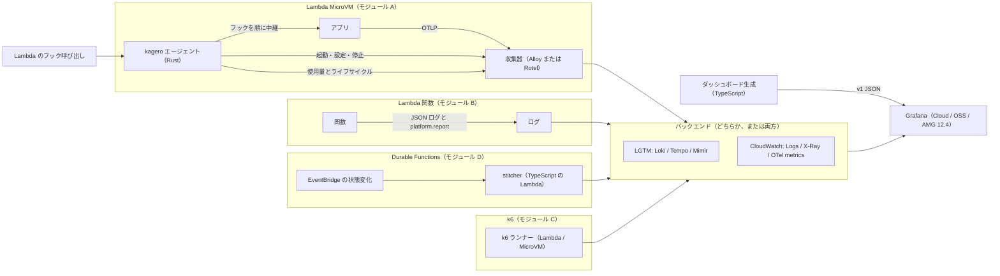

# kagero 全体設計

- 状態: 実装が先行しています（逸脱の記録は [ADR-012](../decisions.md)）。設計の確定は、PoC の結果で行います。
- 最終更新: 2026-09-26
- 関連文書: [MicroVMs の設計](microvms.md) / [関数・Durable・k6 の設計](functions-durable-k6.md) / [ADR](../decisions.md) / [ロードマップ](../roadmap.md) / [PoC](../poc/README.md) / [調査](../research/2026-09-landscape.md)

## 1. 目的と非目的

### 目的

- Lambda ファミリー（関数・Managed Instances・Durable Functions・MicroVMs）を、Grafana で見られるようにします。
- LGTM と CloudWatch のどちらに送っても、同じ見え方になるようにします。
- 商用製品にしかない「計算済みの指標」を、OSS として出します。推定コストやコールドスタートの費用が、その例です。

### 非目的

- Grafana 本体を Lambda で動かすことは目指しません。アラートの評価に常駐プロセスが要るためです。
- Lambda を呼び出すデータソースのプラグインは作りません。需要の兆しがないためです。
- AI による障害対応（AI SRE）は扱いません。すでに混雑している分野だからです。
- v1.0 までは、独自の Lambda extension を作りません。まずログと PromQL で届く範囲を固めます。

## 2. 全体図



## 3. リポジトリの構成

実装が先行しているため（[ADR-012](../decisions.md)）、現在の構成です。

```text
kagero/
├── crates/
│   └── kagero-agent/         # MicroVM の中で動くエージェント（唯一の Rust 部品）
├── packages/                 # pnpm workspace（TypeScript）
│   ├── semconv/              # 属性の定数と文書の生成器（Weaver 互換スキーマの YAML が正本）
│   ├── secrets/              # Secrets Manager の ARN 解決（durable-stitcher / k6-runner 共用）
│   ├── pricing/              # 単価表とコストの計算式
│   ├── dashboards/           # ダッシュボードとアラートの仕様、バックエンド別の adapter
│   ├── sim/                  # フックの simulator（E2E 用）
│   ├── durable-stitcher/     # モジュール D の Lambda
│   ├── k6-runner/            # モジュール C の Lambda
│   └── cdk/                  # CDK constructs
├── semconv/registry/         # 属性の定義（Weaver 互換スキーマの YAML）
├── collector/
│   ├── alloy/                # LGTM 向けの Alloy（river）テンプレート
│   ├── lgtm/                 # LGTM 向けの OTel collector テンプレート
│   ├── cloudwatch/           # CloudWatch 向けの収集器の設定
│   └── rotel/                # Rotel での代替設定
├── generated/                # 生成して commit するダッシュボードとアラート
│   ├── dashboards/{lgtm,cloudwatch}/
│   └── alerts/{lgtm,cloudwatch}/
├── examples/                 # Node.js・Python の MicroVM イメージ例
└── docs/
```

## 4. 言語と道具

言語は「どこで動くか」で分けます（[ADR-001](../decisions.md#adr-001-モノレポと言語の分担)）。

| 場所 | 言語 | 理由 |
|---|---|---|
| MicroVM の中（エージェント） | Rust | メモリとスナップショットを小さく保てます。どのイメージにも単一バイナリで入れられます。プロセスと権限を直接操作できます |
| 外（制御用の Lambda、CDK、ダッシュボード生成、simulator） | TypeScript（Node.js 24） | CDK と Grafana Foundation SDK が TypeScript で使えます。制御用の Lambda は呼ばれる回数が少なく、コールドスタートの差が効きません |

道具:
- Rust: `cargo fmt`、`cargo clippy -D warnings`、`cargo test` を使います。ARM64 の静的バイナリ（`aarch64-unknown-linux-musl`）にします。クロスビルドの手段は cargo-zigbuild を候補にします。
- Rust の主な crate（実装済み）: tokio、hyper、serde、reqwest（rustls）、libc。
- TypeScript: strict、ES modules、Biome、vitest、pnpm を使います。制御用の Lambda は CDK の `NodejsFunction` でデプロイします。
- 属性の定義: Weaver 互換スキーマの YAML を正本にし、`packages/semconv` の生成器が Rust と TypeScript の定数と文書を出します（OpenTelemetry Weaver 本体への移行経路は残しています）。
- 版の固定: mise で道具の版を固定します。依存の更新は Renovate に任せます。
- CI: GitHub Actions を使います。ARM64 の Linux ランナー（`ubuntu-24.04-arm`）でビルドとテストを行っています。

## 5. 2 つのバックエンド

最初から、LGTM と CloudWatch の両方に対応します（[ADR-002](../decisions.md#adr-002-最初から-2-つのバックエンドに対応する)）。移行期間向けに、両方へ同時に送る設定も用意します。

| 信号 | LGTM への送り方 | LGTM での問い合わせ | CloudWatch への送り方 | CloudWatch での問い合わせ |
|---|---|---|---|---|
| メトリクス | OTLP（Mimir / Grafana Cloud、Basic 認証か Bearer） | PromQL（Prometheus データソース） | OTLP HTTP（SigV4） | PromQL（AMP データソース、`sigv4Service=monitoring`） |
| ログ | OTLP（Loki のネイティブ受信） | LogQL | OTLP HTTP（SigV4） | Logs Insights（CloudWatch データソース） |
| trace | OTLP（Tempo） | TraceQL | OTLP HTTP（SigV4、Transaction Search が必要） | X-Ray / Application Signals データソース |

収集器の設定は、送り先の部分（exporter と認証）だけを差し替えます。受け取りと加工の部分は共通にします。

違いが出る点（[PoC-05](../poc/05-backend-parity.md) で確かめます）:
- メトリクス名の変換: 単位の接尾辞、`_total`、UTF-8 の引用、リソース属性のラベル化の扱いが違う可能性があります。
- 上限: CloudWatch PromQL は、1 クエリ 500 系列、期間 7 日が上限です。
- ヒストグラムの種類と、delta / cumulative の扱いが違う可能性があります。
- 費用: CloudWatch PromQL は、API 経由の問い合わせで走査したサンプル数に課金されます。Logs Insights は走査した量に課金されます。
- CloudWatch Logs への OTLP 送信では、ロググループとログストリームを `x-aws-log-group` と `x-aws-log-stream` のヘッダーで指定します。どちらも前もって作っておく必要があります（AWS の文書によります。実機では未確認です）。

## 6. 属性とカーディナリティ

- OTel のセマンティック規約にある属性は、そのまま使います（`service.*`、`cloud.*`、`faas.*` など）。
- 規約にない属性は、`kagero.` を頭に付けます。上流で採用されたら、そちらに移します。
- 定義は Weaver の YAML 1 か所にまとめ、コードと文書はそこから生成します。

主な属性（案）:

| 属性 | 中身 | 付ける信号 |
|---|---|---|
| `service.instance.id` | MicroVM の ID（`/run` で受け取る `microvmId`） | ログ、trace |
| `kagero.microvm.image.name` | イメージ名 | すべて |
| `kagero.microvm.image.version` | イメージのバージョン | すべて |
| `kagero.microvm.size` | baseline の大きさ（例: `2gb`） | すべて |
| `kagero.lifecycle.event` | `run`、`suspend`、`resume`、`terminate` など | ログ、メトリクス |
| `kagero.tenant.id` | テナントの ID（アプリが明示したときだけ） | ログ、trace |
| `kagero.session.id` | セッションの ID（アプリが明示したときだけ） | ログ、trace |

カーディナリティの約束（[ADR-008](../decisions.md#adr-008-識別とカーディナリティ)）:
- MicroVM・テナント・セッション・リクエストの ID は、メトリクスのラベルに入れません。ログと trace にだけ付けます。
- メトリクスのラベルは、イメージ名・バージョン・大きさ・リージョンなど、種類の少ないものに限ります。
- 1 台ごと・1 テナントごとの集計は、停止や終了のたびに出す「使用量の要約ログ」から計算します。

## 7. ダッシュボードとアラートの仕様

1 つの仕様から、2 つのバックエンド向けに生成します（[ADR-010](../decisions.md#adr-010-ダッシュボードとアラートの仕様)）。

- 仕様: Grafana Foundation SDK（TypeScript）で書きます。パネルは「意味で名付けたメトリクス」と、ログや trace の「名前付きレシピ」（15 個まで）を参照します。レイアウト・単位・しきい値は共通にします。
- adapter: バックエンドごとに 1 つ用意します。中身は、データソースの参照、OTel の名前から PromQL のセレクタへの変換（例外表つき）、レシピの実装、対応可否の一覧です。
- 非対応の扱い: 片方で出せないパネルは、「このバックエンドでは非対応」と書いたテキストパネルにします。黙って消しません。
- 出力: v1 の JSON を出します。Amazon Managed Grafana 12.4 は schema v2 に対応していないためです。Grafana 13 は v1 を自動で移行します。
- 置き場所: 生成物は `generated/` に置いて commit します。CI で再生成し、差分が出ないことを確かめます。
- 検証: スナップショットテストと、PromQL・LogQL の構文チェックを行います。構文チェックの手段は PoC-05・06 で決めます。
- 配布: JSON の import、ファイルによる provisioning、gcx や Git Sync（Grafana 13）に対応します。CDK での配布は v0.5 で検討します。
- クエリ費用の約束: 更新間隔は 1 分以上にします。系列の多いパネルは `topk` で絞ります。Logs Insights のパネルは、折りたたんだ行に置きます。

## 8. コストモデル

エージェントは「使用量の事実」だけを送り、単価はクエリ側で掛けます（[ADR-009](../decisions.md#adr-009-コストモデル)）。

- 理由: エージェントは停止中や終了後に動けません。単価をエージェントに埋め込むと、改定のたびにイメージの作り直しが必要になります。
- 表示: すべて「推定」と明記します。請求データ（CUR）と照合して、ずれを公開します。
- 単価表: リージョン・アーキテクチャ・適用開始日で引ける、版つきのファイルにします。AWS Price List API から定期的に取得し、PR で更新します。

計算式（案）:

| 対象 | 式 |
|---|---|
| Lambda 関数（オンデマンド） | リクエスト数 × リクエスト単価 ＋ Σ（INIT を含む課金時間 × メモリ GB）× GB 秒単価（アーキテクチャ別） |
| Managed Instances | リクエスト数 × $0.20/100 万 ＋ EC2 の料金 × 1.15（EC2 の料金は CUR から取ります） |
| Durable Functions | オペレーション数 × $8/100 万 ＋ 関数の料金 |
| MicroVMs | RUNNING の秒数 ×（baseline の GB × メモリ単価 ＋ baseline の vCPU × vCPU 単価）＋ バースト分の GB 秒と vCPU 秒 × 各単価 ＋ 起動と再開の回数 × スナップショットの GB × 読み込み単価 ＋ 停止の回数 × スナップショットの GB × 書き込み単価 ＋ 停止中の GB 月 × 保存単価 |

- 無料枠と、量による割引は含めません。
- MicroVMs の再開でも読み込み料金がかかるか、バースト分をどう測るかは未確認です（[PoC-09](../poc/09-cost-reconciliation.md)）。
- 精度の目標: Lambda 関数は計算式と ±1%（v0.2）、MicroVMs は CUR と ±5%（v0.5）です。

## 9. 脅威モデル

前提: MicroVM の中のアプリは、信頼できないコード（AI が生成したコードなど）かもしれません。

| 守るもの | 脅威 | 対策 |
|---|---|---|
| 送信用の認証情報 | アプリが読み取って持ち出す | 書き込み専用・範囲限定・短命のものにします。イメージの環境変数に入れず、`/run` で取得します。アプリから IMDS に届くかは PoC-01 で確かめます |
| テレメトリの正しさ | アプリが識別属性を偽る | 識別属性は、収集器の側で上書きします。受け取ったテレメトリは「自己申告」として扱います |
| `runHookPayload` | ログや記録に漏れる | エージェントはログに出しません。秘密情報を入れないよう案内します。CloudTrail に残るかは PoC-01 で確かめます |
| フックのポート | 外から呼ばれる | 認証トークンの許可ポートに含めません。外から届かないことは PoC-02 で確かめます。管理用と OTLP のポートは loopback に限ります |
| フックのポート | アプリが MicroVM 自身の IP に接続し、偽のフック（`/run`・`/terminate` など）を送る | 残る危険です。`KAGERO_HOOK_ALLOWED_PEERS` が未設定のとき、kagero が拒むのは loopback からの接続だけです。偽の `/terminate` を受けると、kagero はアプリと収集器を止めます。偽の `/run` が先に成功すると、本物の `/run` は重複として扱われます。塞ぐには、Lambda がフックを送ってくるアドレスを許可リストに設定します。そのアドレスは PoC-02 で確かめます |
| フックと管理用のポート | アプリが先に取り、kagero の代わりに答える | kagero は、アプリを起動する前に両方のポートを確保します |
| OTLP のポート（4318/4317） | 収集器より先にアプリが取り、kagero の使用量とライフサイクルの記録を受け取って捨てる | 残る危険です。収集器を `/run` で起動する設定（既定）では、先に動くアプリがポートを取れます。このとき収集器は起動に失敗し、標準出力に `child exited on its own` の警告が出ます。収集器を起動する時期は、ADR-005 の PoC-03 と PoC-04 で決めます |
| エージェント自体 | ALL 権限のアプリに止められる | ALL 権限は、eBPF を使う人だけの opt-in にします。アプリの権限は、エージェントが起動時に落とします |
| 配布物 | 改ざんされる | cosign で署名し、SBOM を付けます。依存の版を固定します |

## 10. テスト

- 単体テスト: Rust は `cargo test`、TypeScript は vitest で書きます。
- simulator での E2E: TypeScript の simulator が、本物と同じ順序でフックを呼びます。停止と再開は `docker pause` と `docker unpause` で近似します。送り先は `grafana/otel-lgtm` のコンテナにし、Loki・Tempo・Prometheus の HTTP API で結果を確かめます。
- simulator の限界: `docker pause` はメモリのスナップショットを再現しません。スナップショット固有の問題は、PoC と契約テストで確かめます。
- 契約テスト: PoC の手順を、月に 1 回 AWS 上で流し直します。手動で起動し、予算の上限を設けます。
- ダッシュボードのテスト: 再生成の差分、スナップショット、構文チェックを CI で行います。

## 11. リリースとサプライチェーン

- 版: SemVer を使います。0.x の間は、モノレポ全体で 1 つの版にします。
- 配布物:
  - `kagero` バイナリ（`aarch64-unknown-linux-musl`）を GitHub Releases で配ります。
  - OCI イメージを GHCR で配ります。利用者は `COPY --from` でバイナリを取り込みます。
  - npm パッケージは `@seike460/` の下で公開します（CDK constructs などは v0.5 以降）。
  - ダッシュボードは grafana.com で公開します（v0.2 以降）。
- 署名と部品表: cosign（GitHub OIDC によるキーレス署名）で署名し、SBOM を付けます。
- 依存の確認: Rust は cargo-deny でライセンスと脆弱性を確かめる方針です。
- 同梱物のライセンス: Alloy と OBI は Apache-2.0 です。k6 は AGPL-3.0 なので、改変せずに同梱し、ライセンス表示を付けます。
