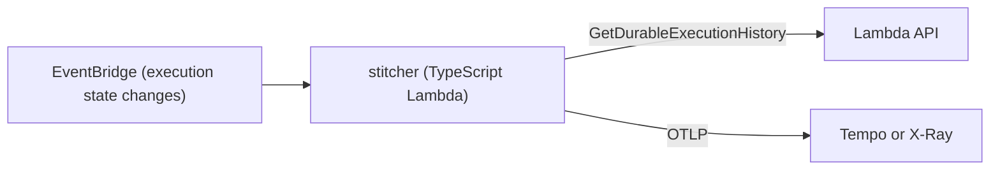

# kagero — Functions, Durable Functions, and k6 design

> English translation of [functions-durable-k6.md](functions-durable-k6.md) (Japanese is canonical). Last synced: 2026-09-27.

- Status: implementation is ahead of this document ([ADR-012](../decisions.en.md)). B ships in v0.2, D in v0.3 (experimental), and C in v0.4 (experimental).
- Last updated: 2026-09-26
- Related documents: [Overall design](architecture.en.md) / [ADR](../decisions.en.md) / [Roadmap](../roadmap.en.md)

## 1. Module B: Lambda function pack

### 1-1. Purpose

- Make Lambda functions observable through dashboards and alerts built on OTel and PromQL.
- Emit cold-start and INIT costs as computed metrics. INIT became billable on 2025-08-01.
- Also support the new Managed Instances metrics.

### 1-2. Data paths

| Signal | LGTM | CloudWatch |
|---|---|---|
| Standard metrics (Invocations, Errors, Throttles, Duration, etc.) | Grafana Cloud ingests them via metric streams. There is no low-cost path to a self-hosted Mimir, so metrics built from logs are used instead | Query with CloudWatch PromQL. Narrow down functions by resource tags |
| Per-invocation records (`platform.report`) | Send JSON logs directly to Firehose and into Loki. For self-hosted setups, receive them with Alloy's `loki.source.awsfirehose` | Send JSON logs to CloudWatch Logs and query with Logs Insights |
| trace | Send from the user's OTel instrumentation to Tempo | View with X-Ray and Application Signals |

- "Metrics built from logs": aggregate invocation count, errors, duration, and cost from `platform.report` logs with LogQL, and store them as metrics with Loki recording rules.
- With Firehose, logs can lag by up to 300 seconds. For alerts that need real-time delivery, recommend the CloudWatch path.

### 1-3. Computed metrics

| Metric | Basis |
|---|---|
| Cold-start rate | Share of `platform.report` records that have an INIT duration |
| Estimated INIT cost | INIT duration × memory GB × GB-second unit price |
| Estimated invocation cost | Billed duration (including INIT) × memory GB × GB-second unit price + request unit price |
| OOM occurrence | Invocations where max used memory reached the allocation, or the error type |
| Timeout occurrence | Invocations whose `platform.report` status is timeout |

- INIT is billed only for on-demand functions on managed runtimes in ZIP format. For all other functions, treat INIT cost as 0.
- Field names in JSON-format logs (billed duration, INIT duration, status, etc.) will be verified in PoC-07.
- With Managed Instances, per-invocation cost is not meaningful. Display concurrency, CPU, memory, and throttling reasons per execution environment.

### 1-4. Dashboards and alerts (v0.2 plan)

Dashboards:
1. Lambda overview: ranks functions by invocation count, error rate, throttling, p95 duration, concurrency, and estimated cost.
2. Cold starts and cost: shows cold-start rate, INIT duration distribution, estimated INIT cost, and per-function cost ranking.

Alerts (6–8):
- Error rate increase
- Throttling occurrence
- p95 duration degradation
- Timeout occurrence
- OOM occurrence
- Sudden cold-start rate increase
- Estimated INIT cost over budget
- Managed Instances throttling (when applicable functions exist)

### 1-5. MVP and exclusions

- In scope: 2 dashboards, 6–8 alerts, generation for both backends, and setup instructions for the log path.
- Out of scope: a custom Lambda extension. Instead, prioritize a PR that adds cost metrics to the OTel `telemetryapi` receiver.
- Out of scope: routing metric streams to a self-hosted Mimir, because no component receives Firehose over OTLP and Alloy has deferred it as well.

### 1-6. Open questions

| Question | PoC to verify |
|---|---|
| What are the `platform.report` field names in JSON-format logs? | PoC-07 |
| Can OOM and timeouts be distinguished reliably from logs alone? | PoC-07 |
| How do `AWS/Lambda` metric names and tags appear in CloudWatch PromQL? | PoC-05 |
| How much do latency and cost differ between Logs Insights and Firehose→Loki? | PoC-07 |
| Do the generated dashboards work on AMG 12.4? | PoC-06 |

## 2. Module D: Durable Functions visualization (experimental)

### 2-1. Purpose

- Make one execution, including replays, visible as a single trace.
- Show the "apparent invocation count" caused by replays separately from the actual amount of work.

### 2-2. Mechanism (plan)

- On notification of execution completion (success, failure, timeout), fetch the execution history.
- The whole execution becomes the root span. Steps, waits, callbacks, and retries become child spans.
- If each invocation has a separate trace, connect them with span links.
- Derive the trace ID deterministically from the execution ARN. Stitching the same execution any number of times yields the same trace.
- Put the replay count in a span attribute.

### 2-3. Data paths

| Signal | LGTM | CloudWatch |
|---|---|---|
| trace | Send to Tempo over OTLP | Send to X-Ray over OTLP (requires Transaction Search) |
| Metrics | Send replay count and execution duration to Mimir over OTLP | Query CloudWatch `DurableExecution*` with PromQL |

### 2-4. MVP and exclusions

- In scope: post-completion stitching, output to Tempo and X-Ray, and the replay count.
- Out of scope: incremental stitching while the execution is running.

### 2-5. Open questions

| Question | PoC to verify |
|---|---|
| The EventBridge events, and the contents and granularity of the history API | PoC-08 |
| Whether Tempo and X-Ray accept spans with old timestamps for long executions | PoC-08 |
| How to change the role if the official OTel plugin issue (#929) is fixed | Revisit after PoC-08 |

If the official plugin is fixed, shift D's role toward "replay and cost analysis".

## 3. Module C: k6 load test runner (experimental)

### 3-1. Purpose

- Run k6 scenarios distributed across Lambda functions and MicroVMs.
- Send the results to LGTM or CloudWatch so they can be viewed in Grafana.

### 3-2. Two execution targets

| Item | Lambda functions | MicroVMs |
|---|---|---|
| Max duration per run | 15 minutes | 8 hours |
| Suitable tests | Short tests split into many shards | Long-running tests and stateful tests |
| Distribution | Step Functions Distributed Map | A launcher Lambda starts N MicroVMs |
| Start alignment | Distribute a start time; each shard waits until that time | Same |

### 3-3. Result destinations

| Execution target | LGTM | CloudWatch |
|---|---|---|
| Lambda functions | Send OTLP directly via k6's OTel output | k6's OTel output is not expected to support SigV4. A candidate approach is writing EMF to stdout (needs verification) |
| MicroVMs | Send k6's OTel output to the collector on the same MicroVM | Send to CloudWatch with SigV4 from the collector on the same MicroVM |

- Record test start and end as Grafana annotations.
- Whether the existing k6 dashboard (#18030) can be reused will be decided by checking the differences in metric names.

### 3-4. License

- k6 is licensed under AGPL-3.0.
- kagero only invokes k6 as a separate program. kagero itself stays Apache-2.0.
- If the k6 binary is bundled for distribution, do not modify it. Per the AGPL terms, show the license notice and how to obtain the source.

### 3-5. MVP and exclusions

- In scope: distributed execution on Lambda and MicroVMs, result output to both backends, and start skew within 2 seconds.
- Out of scope: UI and browser-based tests (k6 browser).

### 3-6. Open questions

| Question | PoC to verify |
|---|---|
| Startup time and start skew when running k6 2.x on Lambda | PoC-10 |
| Whether EMF is sufficient when sending to CloudWatch | PoC-10 |
| How k6's OTel output metric names appear on both backends | PoC-05 |
