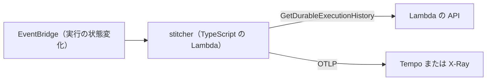

# モジュール B・D・C の設計（Lambda 関数・Durable Functions・k6）

- 状態: 実装が先行しています（[ADR-012](../decisions.md)）。B は v0.2、D は v0.3（実験）、C は v0.4（実験）で出します。
- 最終更新: 2026-09-26
- 関連文書: [全体設計](architecture.md) / [ADR](../decisions.md) / [ロードマップ](../roadmap.md)

## 1. モジュール B: Lambda 関数パック

### 1-1. 目的

- Lambda 関数を、OTel と PromQL を前提にしたダッシュボードとアラートで見られるようにします。
- コールドスタートと INIT の費用を、計算済みの指標として出します。INIT は 2025-08-01 から課金対象になりました。
- Managed Instances の新しいメトリクスにも対応します。

### 1-2. データの経路

| 信号 | LGTM | CloudWatch |
|---|---|---|
| 標準メトリクス（Invocations、Errors、Throttles、Duration など） | Grafana Cloud は metric streams で取り込みます。自前の Mimir には安い経路がないため、ログから作る指標で代わりにします | CloudWatch PromQL で問い合わせます。リソースタグで関数を絞り込みます |
| 呼び出しごとの記録（`platform.report`） | JSON ログを Firehose に直接送り、Loki に入れます。自前の場合は Alloy の `loki.source.awsfirehose` で受けます | JSON ログを CloudWatch Logs に送り、Logs Insights で問い合わせます |
| trace | 利用者の OTel 計装から Tempo へ送ります | X-Ray と Application Signals で見ます |

- 「ログから作る指標」: `platform.report` のログから、呼び出し数・エラー・実行時間・費用を LogQL で集計します。Loki の記録ルールで、メトリクスとして保存します。
- Firehose を使うと、ログが最大 300 秒遅れます。リアルタイム性の要る警報には、CloudWatch 側を勧めます。

### 1-3. 計算済みの指標

| 指標 | 計算のもと |
|---|---|
| コールドスタート率 | INIT の時間を持つ `platform.report` の割合 |
| INIT の推定費用 | INIT の時間 × メモリ GB × GB 秒単価 |
| 呼び出しの推定費用 | 課金時間（INIT を含む）× メモリ GB × GB 秒単価 ＋ リクエスト単価 |
| OOM の発生 | 最大使用メモリが割り当てに達した呼び出し、またはエラーの種類 |
| タイムアウトの発生 | `platform.report` の状態がタイムアウトの呼び出し |

- INIT の課金対象は、マネージドランタイムの ZIP 形式でオンデマンドの関数です。それ以外の関数では、INIT の費用を 0 として扱います。
- JSON 形式のログでの項目名（課金時間、INIT の時間、状態など）は、PoC-07 で確かめます。
- Managed Instances では、呼び出しごとの費用に意味がありません。実行環境ごとの同時実行・CPU・メモリ・スロットリングの理由を表示します。

### 1-4. ダッシュボードとアラート（v0.2 の案）

ダッシュボード:
1. Lambda 概要: 呼び出し数、エラー率、スロットリング、p95 の実行時間、同時実行数、推定費用の上位の関数を並べます。
2. コールドスタートと費用: コールドスタート率、INIT の時間の分布、INIT の推定費用、関数ごとの費用の順位を並べます。

アラート（6〜8 本）:
- エラー率の上昇
- スロットリングの発生
- p95 の実行時間の悪化
- タイムアウトの発生
- OOM の発生
- コールドスタート率の急増
- INIT の推定費用の予算超過
- Managed Instances のスロットリング（対象の関数がある場合）

### 1-5. MVP と入れないもの

- 入れるもの: ダッシュボード 2 つ、アラート 6〜8 本、両方のバックエンド向けの生成、ログの経路の設定手順です。
- 入れないもの: 独自の Lambda extension です。代わりに、OTel の `telemetryapi` receiver へ費用の指標を足す PR を優先します。
- 入れないもの: metric streams を自前の Mimir に流す仕組みです。Firehose を OTLP で受ける部品がなく、Alloy 側でも見送られているためです。

### 1-6. 未解決の問い

| 問い | 確かめる PoC |
|---|---|
| JSON 形式のログで、`platform.report` の項目名は何か | PoC-07 |
| OOM とタイムアウトを、ログだけで確実に見分けられるか | PoC-07 |
| CloudWatch PromQL で、`AWS/Lambda` のメトリクス名とタグはどう見えるか | PoC-05 |
| Logs Insights と Firehose→Loki で、遅れと費用はどれだけ違うか | PoC-07 |
| 生成したダッシュボードが AMG 12.4 で動くか | PoC-06 |

## 2. モジュール D: Durable Functions の可視化（実験）

### 2-1. 目的

- 再実行（replay）を含む 1 つの実行を、1 本の trace として見られるようにします。
- 再実行による「見かけの呼び出し数」と、実際の処理の量を分けて見せます。

### 2-2. 仕組み（案）

- 実行の完了（成功・失敗・タイムアウト）の通知を受けて、実行の履歴を取ります。
- 実行全体を根の span にします。ステップ・待機・コールバック・再試行は、子の span にします。
- 各呼び出しの trace が別にある場合は、span link でつなぎます。
- trace ID は、実行の ARN から決まった方法で作ります。同じ実行を何度組み立てても、同じ trace になります。
- 再実行の回数を、span の属性に入れます。

### 2-3. データの経路

| 信号 | LGTM | CloudWatch |
|---|---|---|
| trace | OTLP で Tempo に送ります | OTLP で X-Ray に送ります（Transaction Search が必要） |
| メトリクス | 再実行の回数と所要時間を、OTLP で Mimir に送ります | CloudWatch の `DurableExecution*` を PromQL で問い合わせます |

### 2-4. MVP と入れないもの

- 入れるもの: 完了後の組み立て、Tempo と X-Ray への出力、再実行の回数です。
- 入れないもの: 実行中の逐次の組み立てです。

### 2-5. 未解決の問い

| 問い | 確かめる PoC |
|---|---|
| EventBridge のイベントと、履歴の API の中身と粒度 | PoC-08 |
| 長い実行で、古い時刻の span を Tempo と X-Ray が受け付けるか | PoC-08 |
| 公式の OTel プラグインの問題（#929）が直ったら、役割をどう変えるか | PoC-08 のあとに再検討 |

公式のプラグインが直った場合は、D の役割を「再実行と費用の分析」に寄せます。

## 3. モジュール C: k6 負荷試験ランナー（実験）

### 3-1. 目的

- k6 のシナリオを、Lambda 関数と MicroVMs で分散実行します。
- 結果を、LGTM か CloudWatch に送って Grafana で見られるようにします。

### 3-2. 2 つの実行先

| 項目 | Lambda 関数 | MicroVMs |
|---|---|---|
| 1 回の上限 | 15 分 | 8 時間 |
| 向いている試験 | 短い試験を大量に分割する | 長時間の試験や、状態を持つ試験 |
| 分散の方法 | Step Functions の Distributed Map | 起動用の Lambda が MicroVM を N 台起動する |
| 開始のそろえ方 | 開始時刻を配り、各シャードがその時刻まで待つ | 同じ |

### 3-3. 結果の送り先

| 実行先 | LGTM | CloudWatch |
|---|---|---|
| Lambda 関数 | k6 の OTel 出力で、OTLP を直接送ります | k6 の OTel 出力は SigV4 に対応していない見込みです。EMF を標準出力に書く方式を候補にします（要確認） |
| MicroVMs | k6 の OTel 出力を、同じ MicroVM の収集器に送ります | 同じ MicroVM の収集器から、SigV4 で CloudWatch に送ります |

- 試験の開始と終了を、Grafana の注釈（annotation）として記録します。
- 既存の k6 ダッシュボード（#18030）を流用できるかは、メトリクス名の違いを見て決めます。

### 3-4. ライセンス

- k6 のライセンスは AGPL-3.0 です。
- kagero は、k6 を別のプログラムとして呼び出すだけです。kagero 自体のライセンスは Apache-2.0 のままにします。
- k6 のバイナリを同梱して配る場合は、改変しません。AGPL の条件に従い、ライセンス表示とソースの入手方法を示します。

### 3-5. MVP と入れないもの

- 入れるもの: Lambda と MicroVMs での分散実行、両方のバックエンドへの結果の出力、開始のずれ 2 秒以内です。
- 入れないもの: UI、ブラウザを使う試験（k6 browser）です。

### 3-6. 未解決の問い

| 問い | 確かめる PoC |
|---|---|
| k6 2.x を Lambda で動かしたときの起動時間と、開始のずれ | PoC-10 |
| CloudWatch へ送る場合に、EMF で足りるか | PoC-10 |
| k6 の OTel 出力のメトリクス名が、両方のバックエンドでどう見えるか | PoC-05 |
