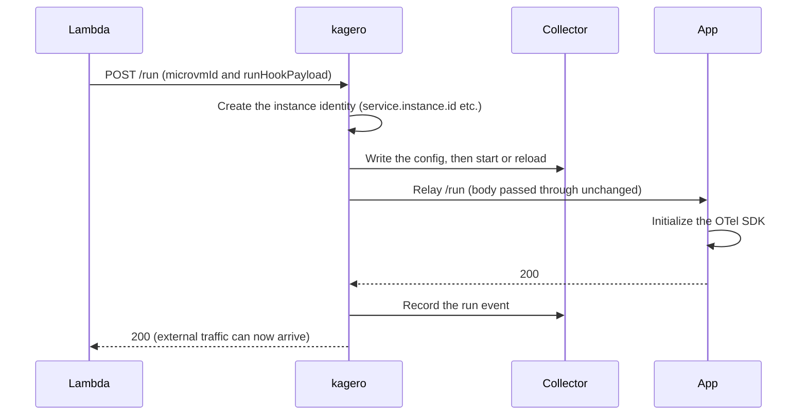
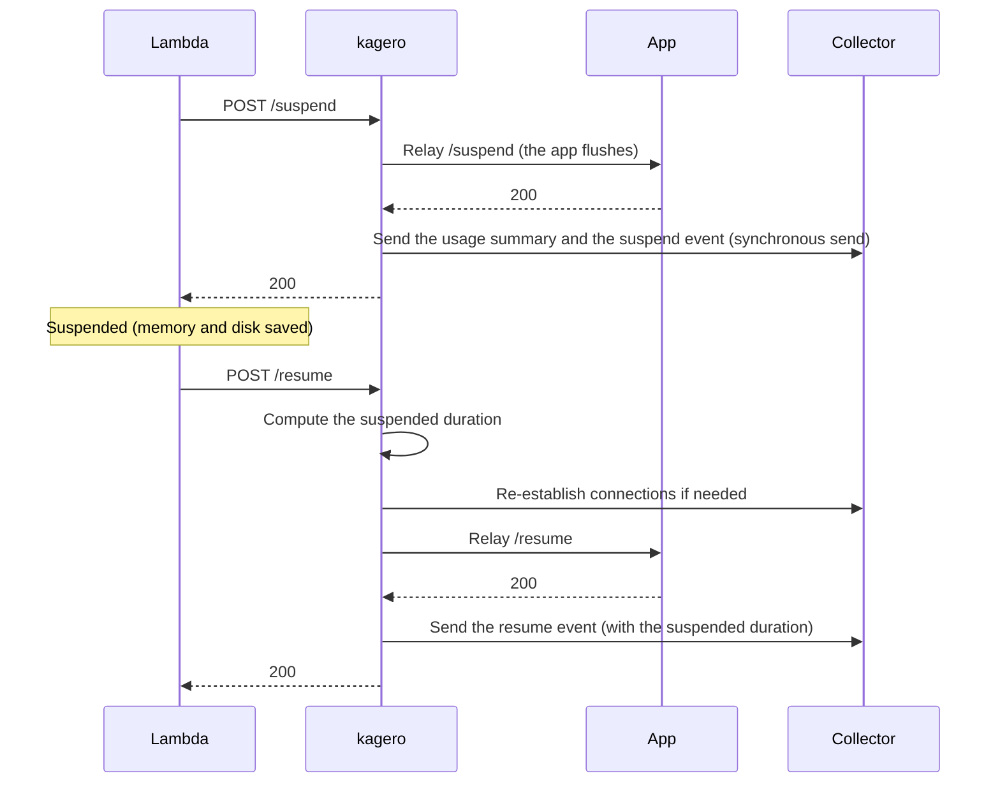
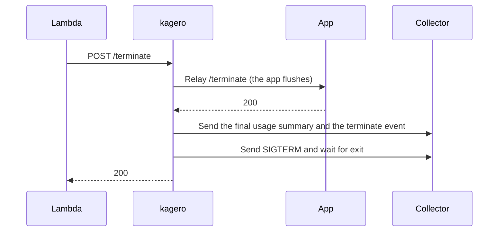

# kagero — Lambda MicroVMs design

> English translation of [microvms.md](microvms.md) (Japanese is canonical). Last synced: 2026-09-27.

- Status: implementation is ahead of this document ([ADR-012](../decisions.en.md)). The details will be finalized based on the results of PoC-01 through PoC-05.
- Last updated: 2026-09-26
- Related documents: [Overall design](architecture.en.md) / [ADRs](../decisions.en.md) / [Research chapter 1 (Japanese)](../research/2026-09-landscape.md#1-aws-lambda-microvms)

## 1. Purpose

Make telemetry inside MicroVMs correctly observable in Grafana. "Correctly" means satisfying the following three requirements:

1. MicroVMs launched from the same image can be told apart, one by one.
2. Telemetry emitted just before suspension or termination is delivered without loss.
3. "No data because it is suspended" can be distinguished from "no data due to a failure".

## 2. Constraints (facts established in research)

- All MicroVMs launched from the same image version start from the same memory state. RNG state and open connections are shared as well.
- Only one port receives hooks. The time limit for runtime hooks is 1–60 seconds.
- Auto-suspend is determined by how long traffic to the endpoint has been absent. While suspended, the processes inside do not run.
- A single MicroVM terminates after at most 8 hours.
- AWS does not provide metrics for MicroVMs. Usage can only be measured from inside.
- The CPU and memory visible from inside are the upper limits, not the baseline (the SigNoz procedure notes the same point).
- Image environment variables are shared across all MicroVMs. They are also carried into snapshots.
- The runtime IAM role is passed via `run-microvm`'s `--execution-role-arn`.
- Only ARM64 CPUs are supported.

## 3. Components

| Component | Language | Role |
|---|---|---|
| `kagero` agent | Rust | The container's init process (PID 1). It is the hook entry point and starts/stops the app and the collector. It also handles instance identity setup and usage recording |
| Collector | — | Alloy (default) or Rotel. Receives OTLP from the app and forwards it to the backend ([ADR-007](../decisions.en.md#adr-007-collector-selection)) |
| App | user's choice | The user's application. Implementing hooks is optional; returning 404 is sufficient if they are not implemented |
| fleet aggregation (v0.5) | TypeScript | A Lambda that periodically calls `ListMicrovms` and `GetMicrovm` to report count and state |

Process tree:

```text
kagero (PID 1, listening on the hook port)
├── collector (accepts OTLP on loopback only)
└── app (launched with dropped privileges; the app hook is on a loopback port)
```

## 4. Lifecycle flow

### 4-1. Build (until the snapshot is taken)

```mermaid
sequenceDiagram
  participant L as Lambda
  participant K as kagero
  participant A as App
  Note over K: Started as ENTRYPOINT (kagero -- app)
  K->>A: Start the app (with dropped privileges)
  L->>K: POST /ready
  K->>A: Relay /ready
  A-->>K: 200 (app initialization complete; telemetry not initialized yet)
  K-->>L: 200
  Note over L: Take the snapshot
  L->>K: POST /validate (in a new MicroVM)
  K->>A: Relay /validate
  A-->>K: 200
  K-->>L: 200
```

### 4-2. Startup (`/run`)



### 4-3. Suspend and resume



### 4-4. Termination



## 5. Hook relay ([ADR-004](../decisions.en.md#adr-004-ordered-hook-relay))

`kagero` relays each hook to exactly one peer in a fixed order. It does not broadcast to multiple processes.

### 5-1. Order

| Hook | Order | Reason |
|---|---|---|
| `/ready`, `/validate` | app → kagero | Instrumentation readiness is checked only after the app is ready |
| `/run`, `/resume` | kagero → app | Instrumentation is set up first, so instance identity is attached from the app's very first telemetry |
| `/suspend`, `/terminate` | app → kagero | The app's flush is received first; kagero completes the final send |

### 5-2. Time budget

- Runtime hooks have a limit of 1–60 seconds.
- The CDK construct sets the same value on the MicrovmImage limit and on kagero's environment variable.
- kagero reserves about 10% of the limit as headroom and splits the rest between relaying to the app and the final send.
- kagero always responds before the limit is exceeded.

### 5-3. Handling failures

- At build time (`/ready`, `/validate`), fail toward stopping: if either the app or kagero fails, the build fails.
- At runtime, fail toward not stopping the workload: even if kagero fails, the app's result is returned. Failures are recorded as `degraded` events.
- If the app returns 404, the hook is treated as "not implemented" and counted as a success.
- The same hook for the same MicroVM is processed only once. Hooks are processed one at a time, in order.
- `runHookPayload` is passed to the app unmodified and is never written to logs.

### 5-4. Ports

| Port | Bound to | Purpose |
|---|---|---|
| Hook | Where Lambda can reach | Receives hooks from Lambda. Not included in the auth-token allowed ports |
| App hook | loopback | Relay from kagero to the app |
| OTLP | loopback | From the app to the collector |
| Admin | loopback | Health checks and internal state |

That the hook port is unreachable from outside is verified in [PoC-02 (Japanese)](../poc/02-hook-contract.md).

## 6. Static at build, started at `/run` ([ADR-005](../decisions.en.md#adr-005-quiesce-at-build-arm-on-run))

Principle: stay static at build time and start at `/run`.

At build time, do not:
- Create unique IDs, RNG seeds, or secrets.
- Open external connections.
- Send telemetry. Apps are guided not to initialize the OTel SDK at build time.

At `/run`:
- Create the instance identity (`service.instance.id`, etc.).
- Configure the collector and fetch secrets.
- The app initializes the OTel SDK.

When to start the collector will be chosen by PoC from two options.

| Option | Pros | Cons |
|---|---|---|
| Start at build time and rewrite the config at `/run` | `/run` finishes quickly | The collector's internal state (RNG, etc.) may be duplicated across clones |
| Start for the first time at `/run` | State is clean | `/run` is slower by the collector's startup time |

- Inputs for the decision: [PoC-03 (Japanese)](../poc/03-snapshot-safety.md) (duplication across clones) and [PoC-04 (Japanese)](../poc/04-flush-and-collector.md) (startup time).
- The clock may drift after resume. If the drift exceeds 1 second, the design waits for clock synchronization before responding to `/run` or `/resume`.
- For apps, examples that place SDK initialization at `/run` will be provided for Node.js and Python (v0.1).

## 7. Guaranteed final delivery ([ADR-006](../decisions.en.md#adr-006-guaranteeing-flush-with-synchronous-export))

Policy: the collector is configured for synchronous sending — no batch processing and no send queue. By the time the app's flush returns, the destination has already received the data.

- `/suspend`: proceed in order — app flush, then kagero's summary send — and return 200 at the end.
- `/terminate`: in addition to the above, send SIGTERM to the collector and wait for it to exit.
- If the destination is down: give up within the time limit and do not stop the workload. The fact that the data could not be sent is recorded to stdout (it remains in CloudWatch Logs).
- Trade-off: waiting for receipt on every send increases app latency. This is expected to be acceptable for sandbox use cases. The amount of latency is measured in PoC-04.

Options not adopted:
- Watching the collector's queue metrics and waiting was not adopted: data inside batches and in-flight requests are not visible. These metrics are used for auxiliary monitoring.
- Making kagero itself an OTLP relay was not adopted: it would mean rebuilding a collector, which is a large maintenance burden.
- If PoC-04 shows that synchronous sending is insufficient, we will consider a simple reverse proxy that does not parse OTLP — one that only counts in-flight requests and waits until the count reaches zero.

## 8. Identity ([ADR-008](../decisions.en.md#adr-008-identity-and-cardinality))

- `service.instance.id` is set to the `microvmId` received at `/run`.
- Tenant and session IDs are attached only when the app explicitly opts in. They are extracted when `runHookPayload` is JSON and the extraction location (a JSON Pointer, e.g. `/tenant/id`) is configured.
- Identity attributes are overwritten on the collector side, so values spoofed by the app do not survive.
- IDs are attached to logs and traces only — never to metrics.

## 9. Usage recording

Every second, kagero reads CPU and memory usage and accumulates the amount above baseline. No unit price is applied ([ADR-009](../decisions.en.md#adr-009-cost-model)).

- CPU: subtract the baseline vCPU-seconds from the vCPU-seconds used in that second; only the positive part is accumulated.
- Memory: subtract the baseline GB from the GB in use; multiply the positive part by the number of seconds and accumulate.
- The baseline value is not visible from inside, so it is passed via configuration (an image environment variable; not a secret).
- Where to read from (the container's cgroup or the VM-wide `/proc`) is decided in PoC-09.

Outputs:

| Type | Contents | Labels/attributes |
|---|---|---|
| Metrics | RUNNING seconds, burst vCPU-seconds and GB-seconds, lifecycle transition counts, suspend-duration distribution | image name, version, size, region (no IDs) |
| Summary log | On each suspend/terminate, emits the period's RUNNING seconds, burst amounts, and counts of starts, resumes, and suspends | microvmId, tenant and session (optional) |

- Per-MicroVM and per-tenant cost is computed from the summary logs.
- Suspend storage cost is computed from the suspend duration and the snapshot size. Whether the snapshot size can be obtained is unconfirmed (PoC-09).

## 10. Distribution and usage (planned)

`kagero` is distributed as an OCI image. Users pull it in with `COPY --from` in their Dockerfile.

```dockerfile
FROM public.ecr.aws/lambda/microvms:al2023-minimal
COPY --from=ghcr.io/seike460/kagero:0.1 /kagero /usr/local/bin/kagero
# The collector (e.g. Alloy) is pulled in the same way
COPY . /app
ENTRYPOINT ["/usr/local/bin/kagero", "--"]
CMD ["/app/start"]
```

- Non-secret settings (backend type, endpoint, baseline, hook time limit) are passed via image environment variables.
- Secrets are fetched from Secrets Manager at `/run` ([ADR-011](../decisions.en.md#adr-011-secret-delivery)).
- The MicrovmImage Hooks are set to kagero's hook port. This will be packaged into a CDK construct in v0.5.

## 11. Open questions

| Question | Verifying PoC |
|---|---|
| How to obtain the execution role's credentials from inside the container; whether the app can also reach them | PoC-01 |
| How Lambda behaves when the hook time limit is exceeded | PoC-02 |
| Whether `/suspend` is also called before auto-suspend | PoC-02 |
| Whether the RNGs of each language's OTel SDK and the collector collide across clones | PoC-03 |
| How much the clock drifts after resume | PoC-03 |
| Whether at least 99.9% of data emitted just before suspension is delivered with synchronous sending | PoC-04 |
| Alloy vs. Rotel: memory usage, startup time, reload time | PoC-04 |
| How to measure the burst portion so that it reconciles with billing | PoC-09 |
| Whether OBI (Beyla) can instrument the app when granted ALL permissions | PoC-10 |
