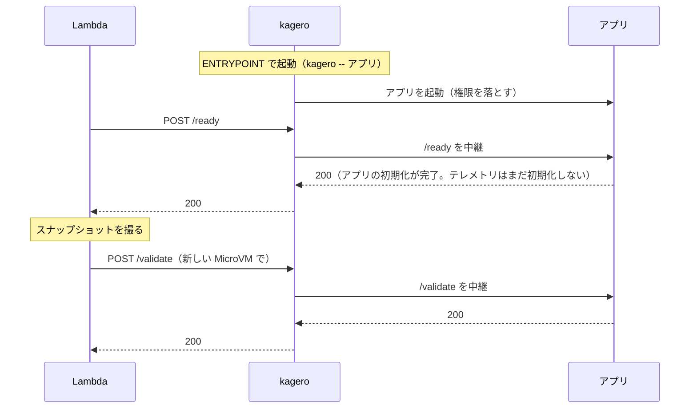
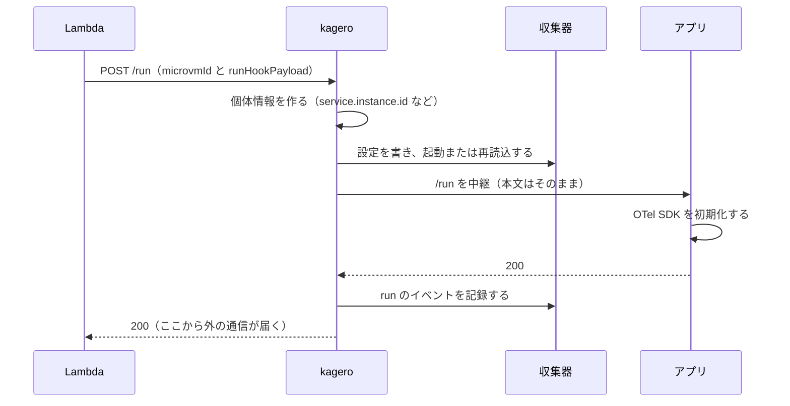
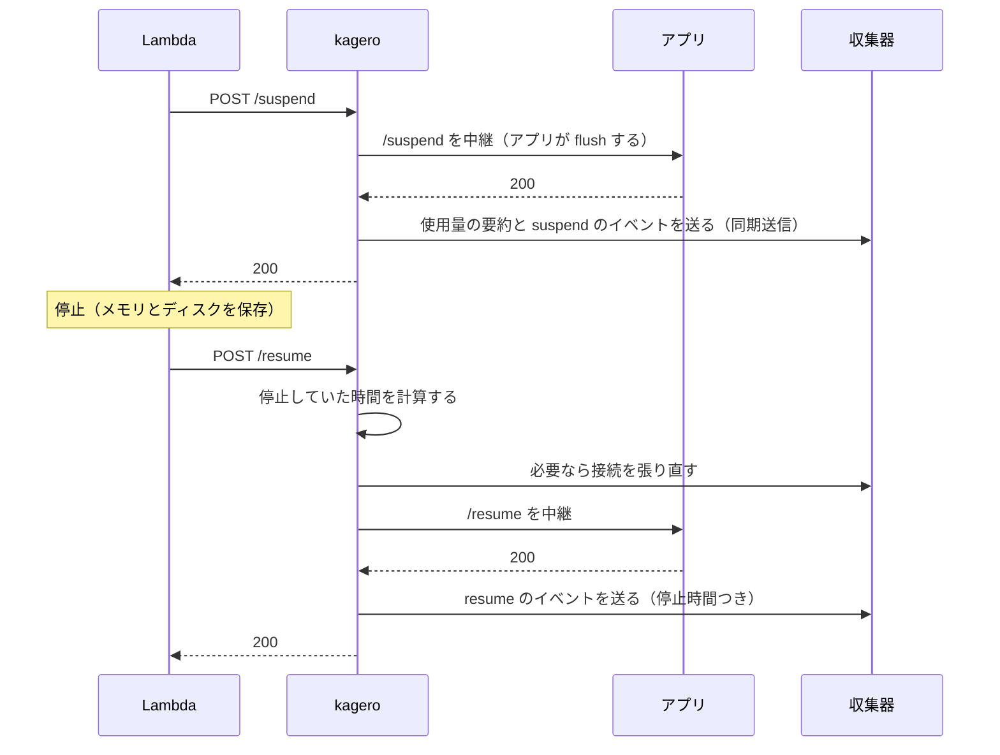
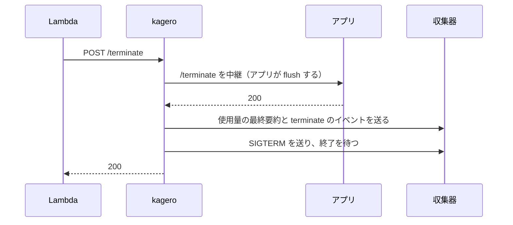

# モジュール A: Lambda MicroVMs の設計

- 状態: 実装が先行しています（[ADR-012](../decisions.md)）。PoC-01〜05 の結果で確定します。
- 最終更新: 2026-09-26
- 関連文書: [全体設計](architecture.md) / [ADR](../decisions.md) / [調査 1 章](../research/2026-09-landscape.md#1-aws-lambda-microvms)

## 1. 目的

MicroVM の中のテレメトリを、Grafana で正しく見られるようにします。「正しく」とは、次の 3 つを満たすことです。

1. 同じイメージから起動した MicroVM を、1 台ずつ見分けられます。
2. 停止や終了の直前に出たテレメトリも、取りこぼさずに届きます。
3. 「停止中でデータがない」と「障害でデータがない」を見分けられます。

## 2. 制約（調査で分かった事実）

- 同じイメージのバージョンから起動した MicroVM は、すべて同じメモリ状態から始まります。乱数の状態や開いた接続も共有されます。
- フックを受けるポートは 1 つだけです。実行時のフックの時間上限は 1〜60 秒です。
- 自動停止は、エンドポイントへの通信が途絶えた時間で判断されます。停止中は、中のプロセスが動きません。
- 1 台は最長 8 時間で終了します。
- AWS は MicroVMs のメトリクスを提供していません。使用量は中で測るしかありません。
- 中から見える CPU とメモリは、baseline ではなく上限の量です（SigNoz の手順にも同じ指摘があります）。
- イメージの環境変数は、すべての MicroVM で共有されます。スナップショットにも写ります。
- 実行時の IAM ロールは、`run-microvm` の `--execution-role-arn` で渡します。
- 対応する CPU は ARM64 だけです。

## 3. 部品

| 部品 | 言語 | 役割 |
|---|---|---|
| `kagero` エージェント | Rust | コンテナの起動役（PID 1）です。フックの受け口になり、アプリと収集器を起動・停止します。個体情報の設定と使用量の記録も担います |
| 収集器 | — | Alloy（既定）か Rotel です。アプリの OTLP を受け、バックエンドへ送ります（[ADR-007](../decisions.md#adr-007-収集器の選択)） |
| アプリ | 利用者が選ぶ | 利用者のアプリです。フックの実装は任意です。実装しない場合は 404 を返せば足ります |
| fleet 集計（v0.5） | TypeScript | `ListMicrovms` と `GetMicrovm` を定期的に呼び、台数と状態を出す Lambda です |

プロセスの親子関係:

```text
kagero（PID 1、フックのポートで待ち受け）
├── 収集器（OTLP は loopback だけで受ける）
└── アプリ（権限を落として起動。アプリ用のフックは loopback のポート）
```

## 4. ライフサイクルの流れ

### 4-1. ビルド（スナップショットを撮るまで）



### 4-2. 起動（`/run`）



### 4-3. 停止と再開



### 4-4. 終了



## 5. フックの中継（[ADR-004](../decisions.md#adr-004-フックの順序つき中継)）

`kagero` は、フックを「決まった順で 1 つの相手に渡す」中継役です。複数のプロセスへの一斉配信はしません。

### 5-1. 順序

| フック | 順序 | 理由 |
|---|---|---|
| `/ready`、`/validate` | アプリ → kagero | アプリの準備ができてから、計測の準備を確かめます |
| `/run`、`/resume` | kagero → アプリ | 計測を先に整えます。アプリの最初のテレメトリから個体情報が付きます |
| `/suspend`、`/terminate` | アプリ → kagero | アプリの flush を先に受けます。最後に kagero が送り切ります |

### 5-2. 時間の配分

- 実行時のフックには、1〜60 秒の上限があります。
- CDK construct が、MicrovmImage の上限と kagero の環境変数に同じ値を設定します。
- kagero は、上限の約 10% を予備に残します。残りを、アプリへの中継と送り切りに分けます。
- kagero は、上限を過ぎる前に必ず返事をします。

### 5-3. 失敗したときの扱い

- ビルド時（`/ready`、`/validate`）は、止める側に倒します。アプリか kagero のどちらかが失敗したら、ビルドを失敗させます。
- 実行時は、業務を止めない側に倒します。kagero 側で失敗しても、アプリの結果を返します。失敗は `degraded` のイベントとして記録します。
- アプリが 404 を返した場合は「未実装」とみなし、成功として扱います。
- 同じ MicroVM の同じフックは、1 回だけ処理します。フックは 1 つずつ順に処理します。
- `runHookPayload` は加工せずにアプリへ渡します。ログには出しません。

### 5-4. ポート

| ポート | 待ち受け先 | 用途 |
|---|---|---|
| フック | Lambda から届く所 | Lambda からのフックを受けます。認証トークンの許可ポートには含めません |
| アプリ用のフック | loopback | kagero からアプリへ中継します |
| OTLP | loopback | アプリから収集器へ送ります |
| 管理用 | loopback | 健康確認や内部の状態を見ます |

フックのポートが外から届かないことは、[PoC-02](../poc/02-hook-contract.md) で確かめます。

フックのポートは、すべてのインターフェースで待ち受けます。`KAGERO_HOOK_ALLOWED_PEERS` が未設定のとき、kagero が拒むのは loopback からの接続だけです。そのためアプリは、MicroVM 自身の IP に接続してフックを偽造できます。これは残る危険です。PoC-02 で Lambda の送信元のアドレスを確かめ、許可リストに設定して塞ぎます（[脅威モデル](architecture.md#9-脅威モデル)）。

## 6. 静止と起動（[ADR-005](../decisions.md#adr-005-ビルド時は静止しrun-で起動する)）

原則: ビルド時は静止し、`/run` で起動します。

ビルド時にしないこと:
- 一意の ID、乱数の種、秘密情報を作りません。
- 外部への接続を張りません。
- テレメトリを送りません。アプリには、OTel SDK をビルド時に初期化しないよう案内します。

`/run` ですること:
- 個体情報（`service.instance.id` など）を作ります。
- 収集器を設定し、秘密情報を取ります。
- アプリが OTel SDK を初期化します。

収集器を起動する時期は、2 つの案から PoC で選びます。

| 案 | 長所 | 短所 |
|---|---|---|
| ビルド時に起動しておき、`/run` で設定を書き換える | `/run` が速く終わります | 収集器の内部状態（乱数など）が複製されるおそれがあります |
| `/run` で初めて起動する | 状態がまっさらです | 収集器の起動時間だけ `/run` が遅くなります |

- 判断の材料は、[PoC-03](../poc/03-snapshot-safety.md)（複製での重なり）と [PoC-04](../poc/04-flush-and-collector.md)（起動時間）です。
- 再開後に時刻がずれる可能性があります。ずれが 1 秒を超える場合は、時刻の同期を待ってから `/run` や `/resume` に返事をする設計にします。
- アプリ向けに、SDK の初期化を `/run` に置く例を Node.js と Python で用意します（v0.1）。

## 7. 送り切り（[ADR-006](../decisions.md#adr-006-送り切りは同期送信で担保する)）

方針: 収集器を同期送信の設定にします。バッチ処理と送信キューを使いません。アプリの flush が戻った時点で、送り先が受け取った状態にします。

- `/suspend`: アプリの flush、kagero の要約送信の順に進め、最後に 200 を返します。
- `/terminate`: 上の手順に加えて、収集器に SIGTERM を送り、終了を待ちます。
- 送り先が落ちている場合: 時間の上限の中で諦め、業務は止めません。送れなかったことは、標準出力に記録します（CloudWatch Logs に残ります）。
- 代償: 送信のたびに受け取りを待つため、アプリの遅れが増えます。サンドボックスの用途では許容できると見込みます。遅れの量は PoC-04 で測ります。

採らなかった案:
- 収集器のキューの数値を見て待つ案は採りません。バッチの中のデータや、送信中の要求が見えないためです。この数値は、補助の監視に使います。
- kagero 自身を OTLP の中継点にする案は採りません。収集器を作り直すことになり、保守の負担が大きいためです。
- 同期送信で足りないと PoC-04 で分かった場合は、OTLP を解釈しない単純な逆プロキシを検討します。送信中の要求の数だけを数え、ゼロになるまで待つ方式です。

## 8. 識別（[ADR-008](../decisions.md#adr-008-識別とカーディナリティ)）

- `service.instance.id` には、`/run` で受け取る `microvmId` を入れます。
- テナントとセッションの ID は、アプリが明示した場合だけ付けます。`runHookPayload` が JSON で、取り出す場所（JSON Pointer。例: `/tenant/id`）を設定したときに取り出します。
- ID に残すのは、ASCII の英数字と `._-@:/+=` だけです。ID は設定ファイルやシェルの中に埋め込まれるため、ほかの文字は取り除きます。何も残らない ID は付けません。
- 識別属性は、収集器の側で上書きします。アプリが偽った値は残りません。
- ID はログと trace にだけ付け、メトリクスには付けません。

## 9. 使用量の記録

kagero は 1 秒ごとに CPU とメモリの使用量を読み、baseline を超えた分を積み上げます。単価は掛けません（[ADR-009](../decisions.md#adr-009-コストモデル)）。

- CPU: その 1 秒に使った vCPU 秒から、baseline の vCPU 秒を引きます。正の部分だけを積み上げます。
- メモリ: 使っている GB から baseline の GB を引きます。正の部分に秒数を掛けて積み上げます。
- baseline の値は、中から見えないため設定で渡します（イメージの環境変数。秘密ではありません）。
- どこから読むか（コンテナの cgroup か、VM 全体の `/proc` か）は、PoC-09 で決めます。

出すもの:

| 種類 | 中身 | ラベル・属性 |
|---|---|---|
| メトリクス | RUNNING の秒数、バースト分の vCPU 秒と GB 秒、ライフサイクルの遷移回数、停止時間の分布 | イメージ名、バージョン、大きさ、リージョン（ID は付けません） |
| 要約ログ | 停止・終了のたびに、その区間の RUNNING 秒数、バースト分、起動・再開・停止の回数を出します | microvmId、テナントとセッション（任意） |

- 1 台ごと・1 テナントごとの費用は、要約ログから計算します。
- 停止中の保存料は、停止時間とスナップショットの大きさから計算します。スナップショットの大きさを取得できるかは、未確認です（PoC-09）。

## 10. 配布と使い方（予定）

`kagero` は OCI イメージで配ります。利用者は Dockerfile の `COPY --from` で取り込みます。

```dockerfile
FROM public.ecr.aws/lambda/microvms:al2023-minimal
COPY --from=ghcr.io/seike460/kagero:0.1 /kagero /usr/local/bin/kagero
# 収集器（例: Alloy）も同じように取り込みます
COPY . /app
ENTRYPOINT ["/usr/local/bin/kagero", "--"]
CMD ["/app/start"]
```

- 秘密でない設定（バックエンドの種類、エンドポイント、baseline、フックの時間上限）は、イメージの環境変数で渡します。
- 秘密情報は、`/run` の時点で Secrets Manager から取ります（[ADR-011](../decisions.md#adr-011-秘密情報の渡し方)）。
- MicrovmImage の Hooks には、kagero のフックのポートを設定します。v0.5 で CDK construct にまとめます。

## 11. 未解決の問い

| 問い | 確かめる PoC |
|---|---|
| コンテナの中から、実行ロールの資格情報をどう取れるか。アプリからも届いてしまうか | PoC-01 |
| フックの時間上限を超えたとき、Lambda はどう振る舞うか | PoC-02 |
| 自動停止の前にも `/suspend` が呼ばれるか | PoC-02 |
| 各言語の OTel SDK と収集器の乱数は、複製の間で重なるか | PoC-03 |
| 再開後に時刻はどれだけずれるか | PoC-03 |
| 同期送信の設定で、停止の直前のデータが 99.9% 以上届くか | PoC-04 |
| Alloy と Rotel の、メモリ・起動時間・再読込の時間 | PoC-04 |
| バースト分をどう測れば、請求と合うか | PoC-09 |
| ALL 権限のとき、OBI（Beyla）でアプリを計装できるか | PoC-10 |
